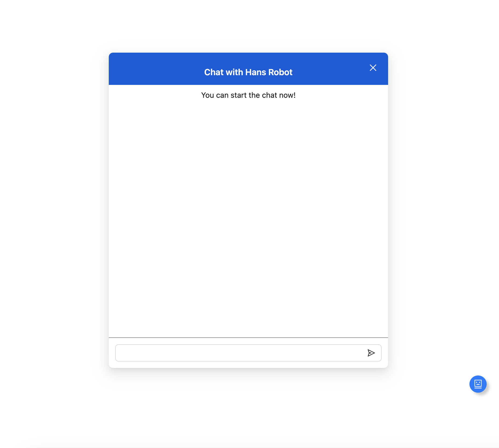
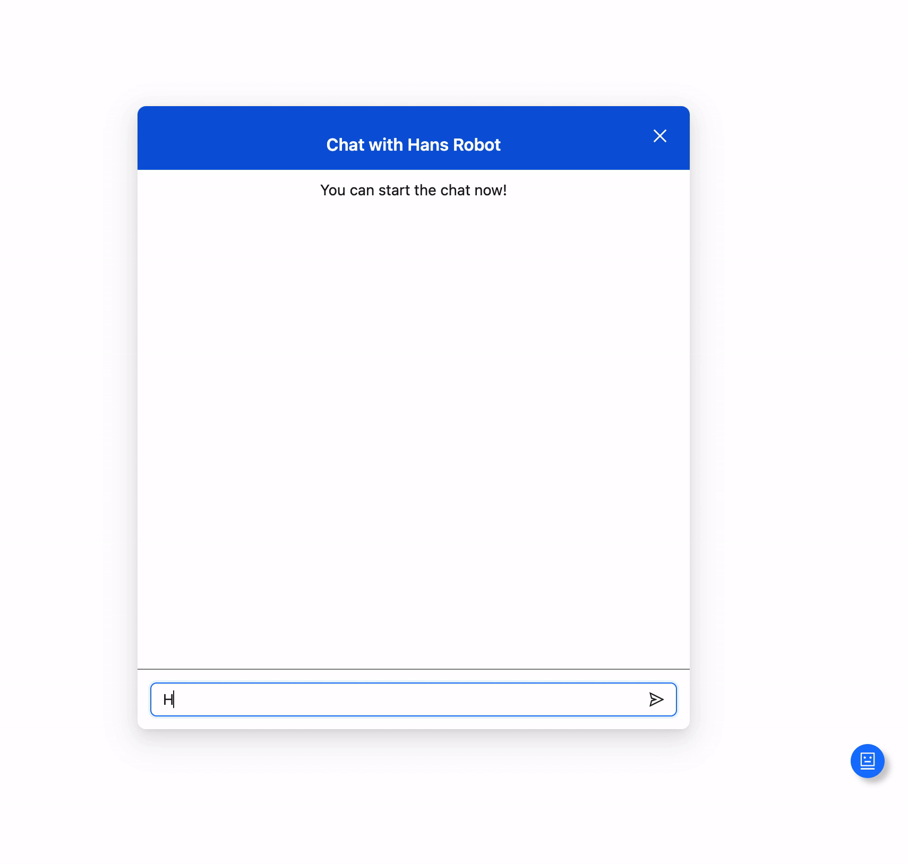
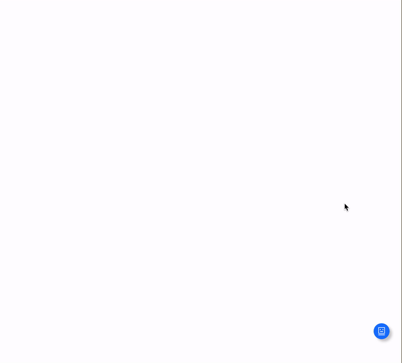
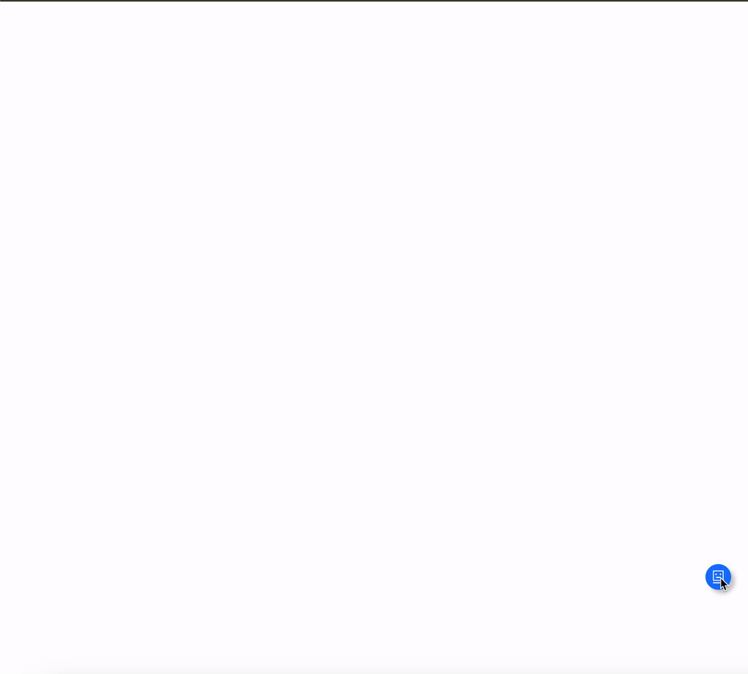

# chatbot-demo
## Overview
This is a chatbot demo built by React.js and Node.js(Koa) server supporting stream text generation.

### Fundemental
Chatbot can be triggered by the blue dot docked to the edge of window.
Click the blue dot and you will see the main conversation modal.


### Send Hello
Send 'Hello' or '你好' or '您好', and it will response your username.


### Send other command started with slash
Follow the instruction and send commands, you will get different result.

Send /reading and generate a long-text article


### Drag and drop to adjust the dot's position
Drag the dot and drop, it will dock to the closest horizontal edge of window.


## Usage

### Run locally
#### Install dependencies
`yarn install` or `npm install` or `pnpm install`(Project used)

#### Start vite-server and koa server
> pnpm run dev

It's equivlant to
> pnpm run dev-client & pnpm run dev-server

Access `http://localhost:5173` after server started.

### Use it in your application
```typescript
import { ChatBot } from './chatbot';

function App() {
  return (
    <div className="relative overflow-hidden bg-white flex" style={{ width: '100vw', height: '100vh' }}>
      <ChatBot />
    </div>
  );
}

export default App;
```


